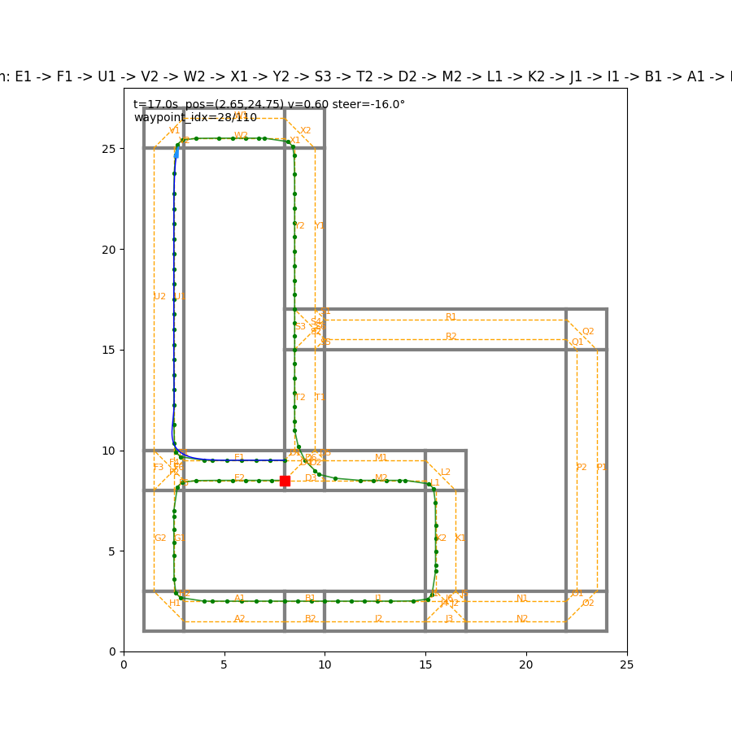

# A tool to simulate a robot driving on a map using matplotlib
W.I.P.

# To Build lane graph
```
- python makeLanes.py ./config/map1.yml
```
map1.yml is an example map

# To Run map
```
- python simControl.py mapTest.yml <starting lane ID> <ending lane ID>
example
- python simControl.py mapTest.yml E1 E2
```

